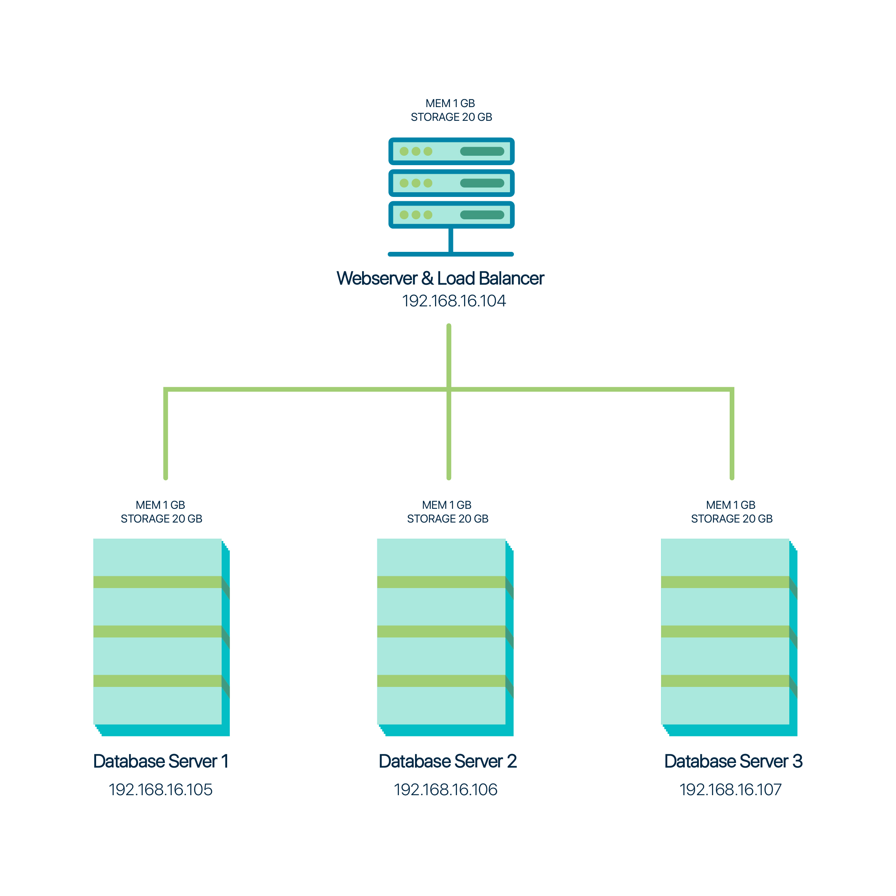
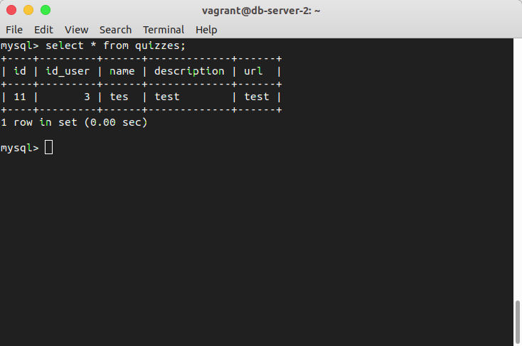
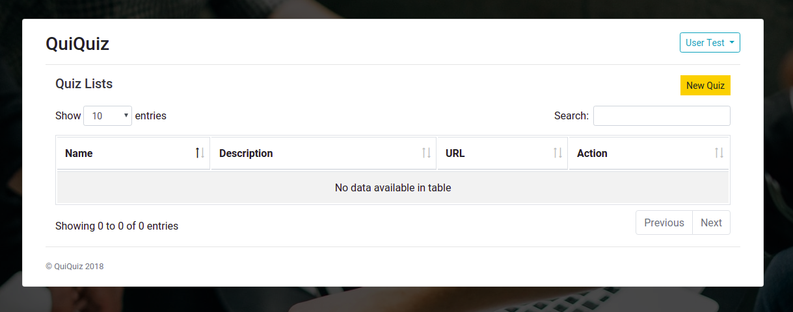
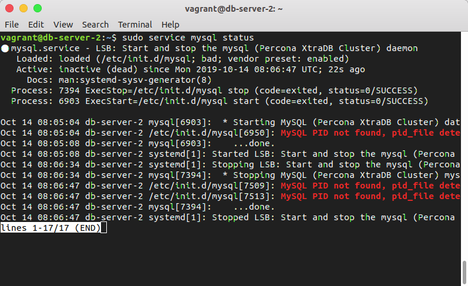
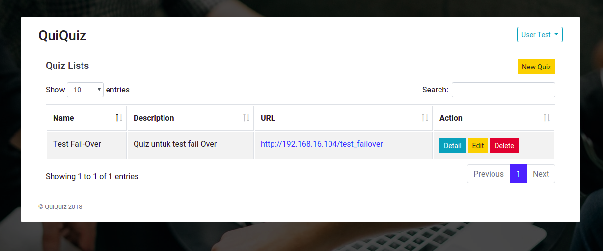
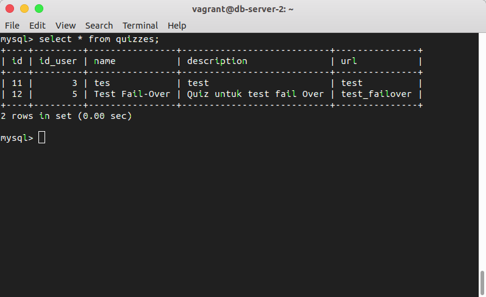

# Database Replication: Percona XtraDB Cluster + ProxySQL
Distributed database implementation using Percona XtraDB Cluster 5.7 and ProxySQL.

## Architecture



## Technology Stack
- Apache2
- Percona XtraDB Cluster 5.7
- ProxySQL
- Vagrant

## About QuiQuiz


&nbsp;&nbsp;&nbsp;&nbsp;&nbsp;QuiQuiz merupakan final project untuk kelas Pemrograman Web. QuiQuiz adalah aplikasi web yang berfungsi sebagai platform untuk membuat quiz dan dapat membagikannya dengan berupa link.

## Installation

### Prerequisites

- Vagrant ([Download here](https://www.vagrantup.com/))
- Ubuntu vagrant box ([ubuntu/xenial64](https://app.vagrantup.com/ubuntu/boxes/xenial64))

### Usage

- Running Application

    ```
    vagrant up
    ```

- Stopping Application

    ```
    vagrant halt
    ```

## Configuration Step

### Percona XtraDB Cluster
- Install Percona XtraDB Cluster 5.7 pada db-server-1, db-server-2, dan db-server-3.
- Konfigurasi file wsrep.cnf untuk masing-masing database node.
- Inisialisasi salah satu node.
    ```
    /etc/init.d/mysql bootstrap-pxc
    ```
- Tambahkan node lain
    ```
    /etc/init.d/mysql start
    ```

### ProxySQL
- Install ProxySQL pada web-server.
- Install Percona XtraDB Client.
- Tambahkan database cluster node ke ProxySQL
    ```
    INSERT INTO mysql_servers(hostgroup_id, hostname, port) VALUES (0, '192.168.16.105', 3306);
    INSERT INTO mysql_servers(hostgroup_id, hostname, port) VALUES (0, '192.168.16.106', 3306);
    INSERT INTO mysql_servers(hostgroup_id, hostname, port) VALUES (0, '192.168.16.107', 3306);
    ```
- Membuat ProxySQL Monitoring User
    Pada database server:
    ```
    CREATE USER 'proxysql'@'%' IDENTIFIED BY 'ProxySQLPa55';
    GRANT USAGE ON *.* TO 'proxysql'@'%';
    ```
    Pada ProxySQL server:
    ```
    UPDATE global_variables SET variable_value='proxysql' WHERE variable_name='mysql-monitor_username';
    UPDATE global_variables SET variable_value='ProxySQLPa55' WHERE variable_name='mysql-monitor_password';
    ```
- Membuat ProxySQL Client User
    Pada ProxySQL server:
    ```
    INSERT INTO mysql_users (username,password) VALUES ('sbuser','sbpass');
    ```
    Pada database server:
    ```
    CREATE USER 'sbuser'@'192.168.70.64' IDENTIFIED BY 'sbpass';
    GRANT ALL ON *.* TO 'sbuser'@'192.168.70.64';
    ```

### Web Server
- Install Apache2
- Install PHP
- Enable mod_rewrite
    ```
    sudo a2enmod rewrite
    ```
- Clone application
    ```
    git clone https://github.com/muhajirrr/QuiQuiz
    ```

## Fail-Over Simulation

- Kondisi awal (semua database server online)

    
    

- Database Server 2 dimatikan
    ```
    sudo service mysql stop
    ```
    

- Tambah quiz baru
    

- Database Server 2 dinyalakan
    ```
    sudo service mysql start
    ```
    Data otomatis sinkron dengan database server lain.
    